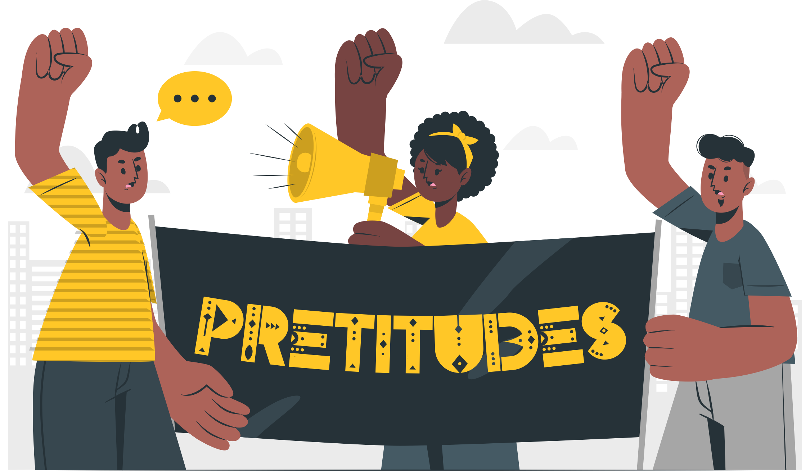
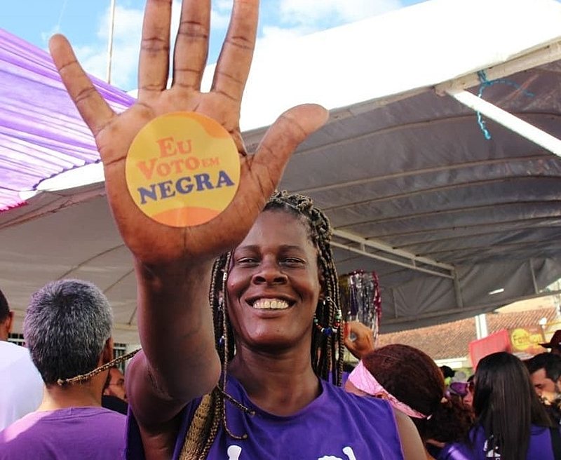

  <a>
    <a href="https://pretitudes-project-reprograma.herokuapp.com/">
    <a href="https://www.mongodb.com/cloud/atlas">
    

<h1 align="center">
  

Pretitudes - Ocupação preta na política

</h1>

> Banco de dados de candidaturas negras que concorreram a eleição municipal 2020 na Região Metropolitana do Recife (PE).

> Status: **Concluído** :heavy_check_mark:

## **Sumário**

- [Apresentação](#apresentação)
- [Contextualização](#contextualização)
- [Fonte dos dados](#fonte-dos-dados)
- [Funcionalidades](#funcionalidades)
- [Tecnologias, dependências e bibliotecas](#tecnologias-dependências-e-bibliotecas)
- [Instruções para instalação e contribuições no projeto](#instruções-para-instalação-e-contribuições-no-projeto)
- [Features e rotas](#features-e-rotas)
- [Referências](#referências)

## **Apresentação**

O "Pretitudes" é o projeto de conclusão do bootcamp de Back-end da [{reprograma}](https://reprograma.com.br/), em parceria com o [projeto MINAs do Porto Digital](https://www.portodigital.org/capital-humano/iniciativas-para-a-diversidade/mulheres-em-inovacao-negocios-e-artes-minas). Essa é uma API que tem por objetivo reunir informações sobre as candidaturas negras comprometidas com a pauta antirracista na Região Metropolitana do Recife.

A ideia é que ela possa ser aproveitada por um programa de formação política e qualificação, quem sabe até de investimento, potencializando o movimento negro no próximo pleito eleitoral em 2024.

## **Contextualização**

A ausência de representação negra nos parlamentos é um problema há muito denunciado pelos movimentos negros brasileiros. Se no Brasil mais de 56% das pessoas se declaram negras, os dados de composição racial nas casas legislativas espalhadas pelo país demonstram o tamanho do abismo. Segundo dados do TSE, negros somam 24,4% dos deputados federais e 28,9% dos deputados estaduais eleitos em 2018 e, dos vereadores eleitos em 2016, somam 42,1% de pretos e pardos. (Fonte: Votos Antirarcistas, 2020)

## **Fonte dos dados**

Essa aplicação é desenvolvida em parceria com o [#VotosAntirracistas](https://votosantirracistas2020.com.br/), uma plataforma on-line que reúne e apresenta candidaturas negras comprometidas politicamente com as pautas históricas dos movimentos negros do Brasil, explicitadas no [Manifesto Enquanto Houver Racismo Não Haverá Democracia](https://comracismonaohademocracia.org.br/), na [Carta de Princípios e Agenda da Coalizão Negra por Direitos](https://coalizaonegrapordireitos.org.br/sobre/), na [Agenda Marielle Franco](https://www.agendamarielle.com/) e na [Carta da Convergência Negra em defesa da vida, do emprego e da participação negra na política](https://www.abpn.org.br/post/carta-resultante-da-plen%C3%A1ria-nacional-da-converg%C3%AAncia-negra).

Também é usado como complemento de dados o site do [Tribunal Superior Eleitoral - TSE](https://divulgacandcontas.tse.jus.br/divulga/#/).

## **Funcionalidades**

- [X] Login de pessoa administradora da API (cadastro, atualização e remoção de administradores)
- [X] Cadastro de candidaturas negras
- [X] Lista de todas as candidaturas negras cadastradas
- [X] Lista de todos os movimentos sociais das candidaturas negras cadastradas
- [X] Lista de candidaturas negras por cidade da Região Metropolitana do Recife
- [X] Lista de candidaturas negras eleitas em 2020
- [X] Atualização de cadastro de candidaturas
- [X] Remoção de candidaturas que não façam parte de movimentos sociais

## **Tecnologias, bibliotecas e dependências**

  <a>
    <a href="https://git-scm.com/">
    <a href="https://nodejs.org/pt-br/">
    <a href="https://www.mongodb.com/cloud/atlas">
    <a href="https://herokuapp.com/">
     
    <a href="https://www.npmjs.com/">
    <a href="https://expressjs.com/pt-br/">
    <a href="https://mongoosejs.com/">
    <a href="https://www.npmjs.com/package/dotenv-safe">
    <a href="https://www.npmjs.com/package/bcryptjs">
    <a href="https://www.npmjs.com/package/jsonwebtoken">
     

## **Instruções para instalação e contribuições no projeto**

- Faça um `fork` do projeto através do link (<https://github.com/priscilaestevao/pretitudes-project-reprograma/fork>);

- Copie o código do _fork_ realizado e, no _prompt de comando_ da sua máquina, realize o clone do projeto através do `git clone <link_do_fork_do_repositorio>`;

- Crie uma _branch_ para realizar suas contribuições `git checkout -b feature/<sua_branch>`;

- Instale as dependências necessárias à execução da API através do comando `npm install`;

- No raiz do projeto, renomeie `.env.example` para `.env` e adicione os valores das variáveis `PORT` (porta sugerida `8080`), `MONGODB_URL` (string de conexão com o banco de dados) e `SECRET` (chave RSA). Elas são necessárias para a execução da API em sua máquina

- Para executar a API, utilize o comando `npm start` no seu terminal;

- Após suas contribuições no projeto, realize o _commit_ com o comando `git commit -m 'sua mensagem'`;

- Para subir o projeto no seu GitHub, basta executar o comando `git push origin feature/<sua_branch>`;

- E finalize criando um novo _Pull Request_ com as contribuições para o projeto original.

## **Features e rotas**

Esta API está sendo escutada na `porta 8080` e para que todas as rotas possam ser acessadas localmente é necessário usar `http://localhost:8080/` antes dos endpoints de requisição.

### _Manipulando registros como pessoa usuária_

| Feature | Método | Rota |
|---------|--------|------|
| Lista de todas as candidaturas negras de 2020 | GET | `/candidaturas-negras` |
| Lista de todos os movimentos populares | GET | `/candidaturas-negras/lista-movimentos` |
| Filtro de candidaturas negras por cidade | GET | `/candidaturas-negras/cidade/<nome-da-cidade>` |
| Lista de candidaturas negras eleitas em 2020 | GET | `/candidaturas-negras/eleitas2020` |

### _Manipulando registros como pessoa administradora (requer token de autenticação)_

| Feature | Método | Rota |
|---------|--------|------|
| Login de pessoa administradora | POST | `/admin/login` |
| Cadastro de candidaturas negras | POST | `/candidaturas-negras` |
| Atualização de cadastro de candidaturas por id | PUT | `/candidaturas-negras/:_id` |
| Remoção de candidaturas que não são de movimentos sociais | DELETE | `/candidaturas-negras/participacao?movimentoSocial=unidefined` |
| Cadastro de pessoa administradora | POST | `/admin/` |
| Lista de todas as pessoas administradoras | GET | `/admin` |
| Atualização de cadastro de pessoa administradora por id | PUT | `/admin/:id` |
| Remoção de pessoa administradora por email | DELETE | `/admin?email=<email_da_pessoa_administradora_castrada>` |

## **Referências**

[{reprograma} - Projeto Final](https://github.com/reprograma/on7-porto-s17-s18-projeto-livre)

[Como escrever um README.md sensacional no Github](https://dev.to/reginadiana/como-escrever-um-readme-md-sensacional-no-github-4509#o-que-%C3%A9-o-readme)

[Inspiração: Pokemons API (autoria: @AnnaNee)](https://github.com/AnnaNee/pokemons-api)

[Tribunal Superior Eleitoral](https://www.tse.jus.br/)

[Votos Antirracistas](https://votosantirracistas2020.com.br/)

Criado com :black_heart: por **Priscila Estevão** e o apoio das professoras, monitoras, orientação pedagógica e minhas queridas companheiras de turma. Sou só gratidão!

